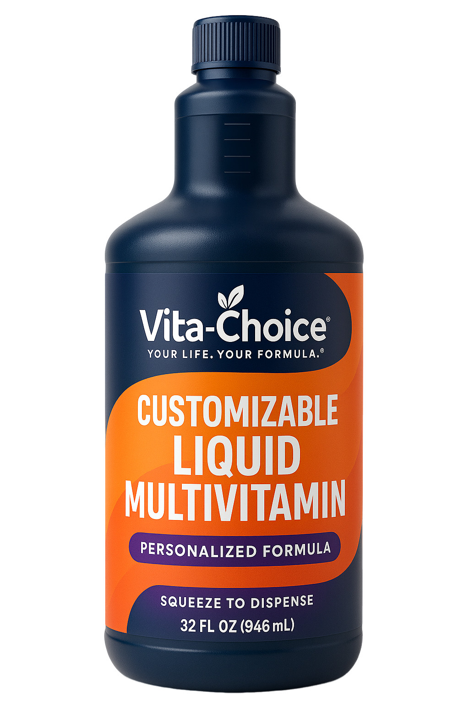

# Vita-Choice



## 🚀 Complete Nutrition Platform

**Vita-Choice** is a comprehensive nutrition platform consisting of a modern web application and mobile app, designed to provide personalized supplement recommendations and premium health products.

## 📁 Project Structure

```
Vita-Choice/
├── app/                    # Next.js 15 Web Application
│   ├── components/         # Reusable UI components
│   ├── lib/               # Utilities and constants
│   └── (pages)/           # App router pages
├── VitaChoiceMobile/      # React Native Mobile App
│   ├── src/
│   │   ├── components/    # Mobile UI components
│   │   ├── screens/       # App screens
│   │   ├── services/      # API services
│   │   └── constants/     # Design system
│   └── assets/           # Mobile app assets
└── public/               # Static assets
```

## 🌐 Web Application (Next.js 15)

### Features
- 🎨 Modern design with Tailwind CSS
- ⚡ Next.js 15 with Turbopack
- 🚀 Framer Motion animations
- 📱 Fully responsive design
- 🛒 Product catalog and shopping
- 📞 Contact forms with API integration
- 📋 Policy pages and legal compliance

### Tech Stack
- **Framework:** Next.js 15
- **Styling:** Tailwind CSS 4
- **Animations:** Framer Motion
- **Language:** TypeScript
- **Deployment:** Vercel

## 📱 Mobile Application (React Native)

### Features
- 🎨 Premium UI with gradient designs
- 🔄 SVG support with custom icons
- 📊 Modern animated headers
- 🌐 Full API integration
- 📄 Complete policy screens
- 🛒 Product browsing and details
- 📞 Contact forms and newsletter signup

### Tech Stack
- **Framework:** React Native with Expo
- **Navigation:** React Navigation 6
- **Styling:** StyleSheet with design system
- **Icons:** Expo Vector Icons
- **Language:** TypeScript
- **Build:** EAS Build for APK generation

## 🚀 Getting Started

### Web Application
```bash
# Install dependencies
npm install

# Start development server
npm run dev

# Build for production
npm run build
```

### Mobile Application
```bash
# Navigate to mobile app
cd VitaChoiceMobile

# Install dependencies
npm install

# Start Expo development server
npm start

# Build APK
npm run build:android
```

## 🌐 API Integration

Both applications integrate with the Vita-Choice backend:
- **Base URL:** `https://api.thevitachoice.com/api`
- **Endpoints:** Products, Contact, Newsletter, Waitlist

## 📦 Deployment

### Web (Vercel)
- Automatically deploys from main branch
- Custom domain configuration supported
- Environment variables managed through Vercel dashboard

### Mobile (EAS Build)
- Build APKs with `eas build --platform android`
- Deploy to Google Play Store
- TestFlight for iOS builds

## 🔧 Development

### Prerequisites
- Node.js 18+
- npm or yarn
- Expo CLI (for mobile development)
- Android Studio (for Android builds)

### Environment Variables
Create `.env.local` files with required API endpoints and keys.

---

**🌟 Built with modern web and mobile technologies for optimal performance and user experience.**